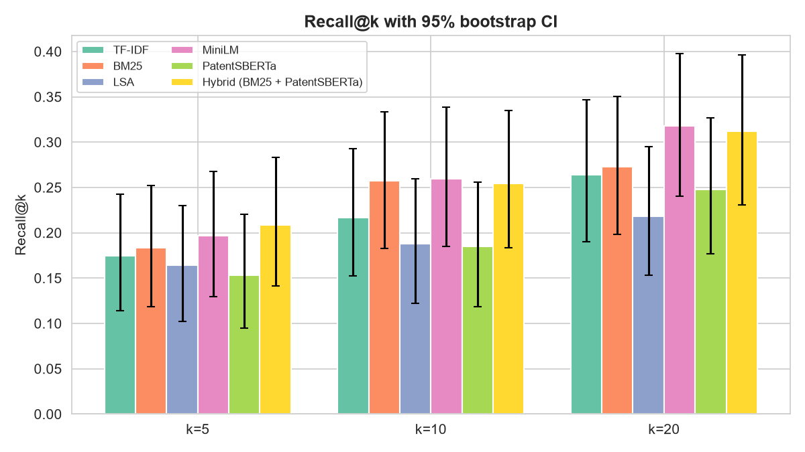
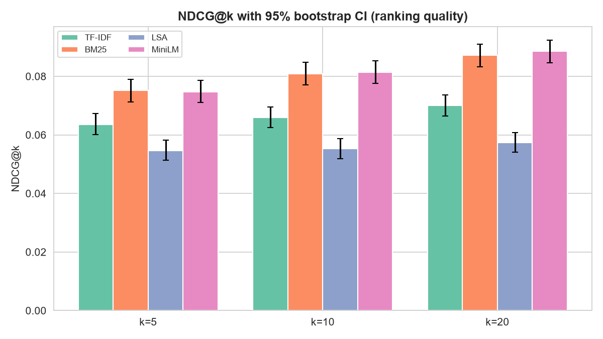
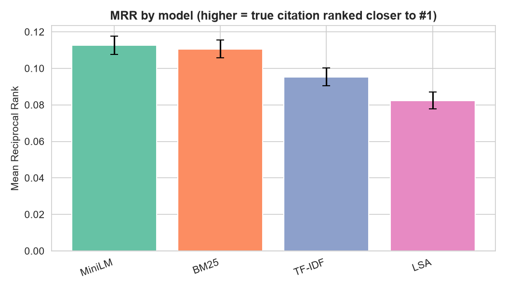
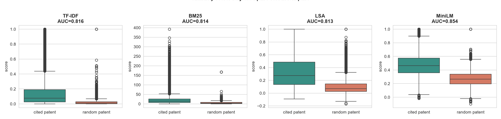
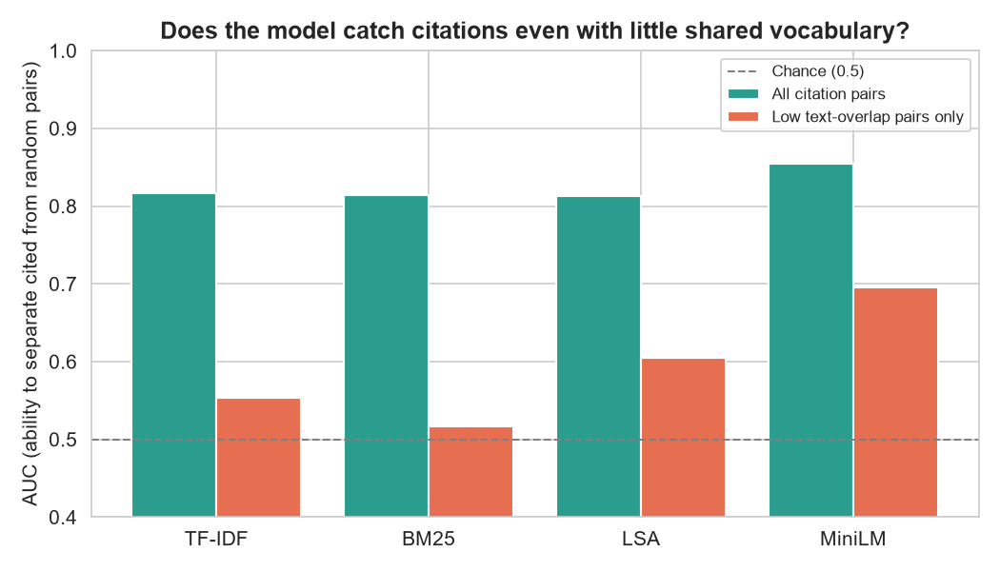
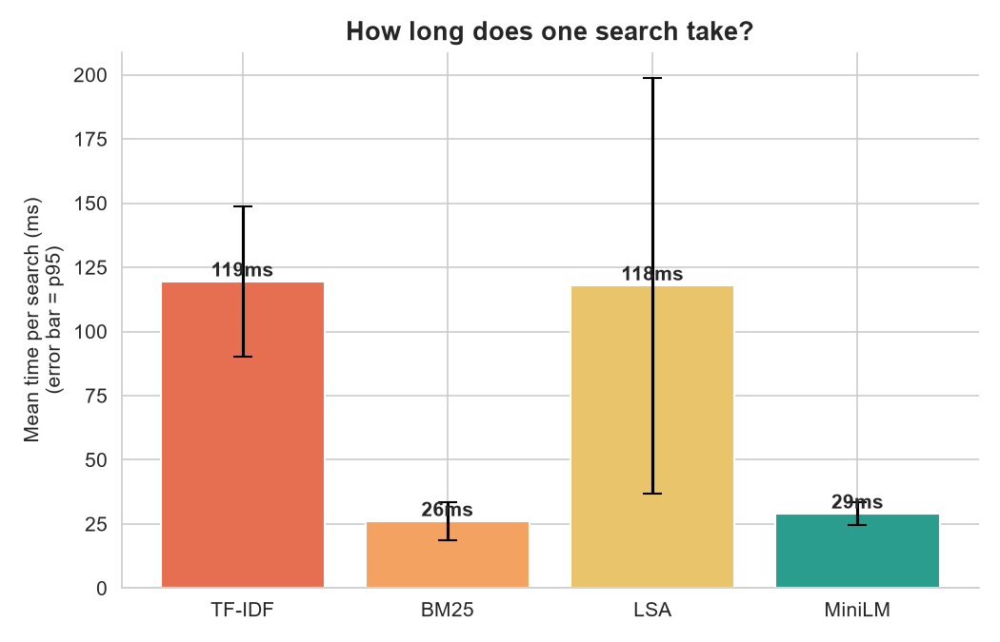
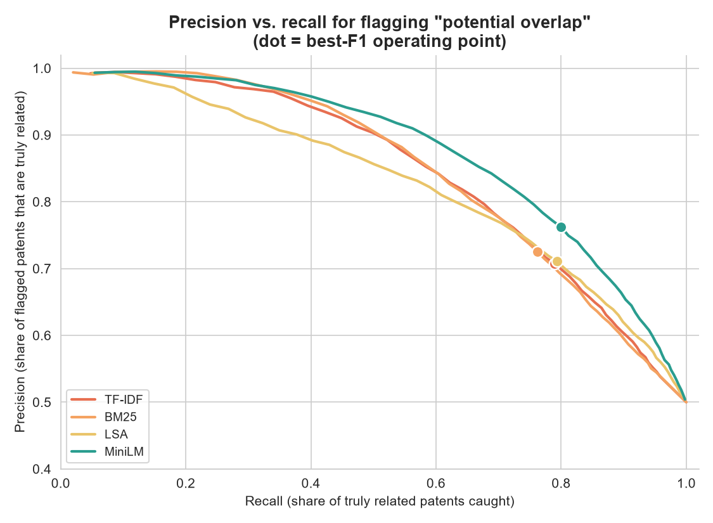
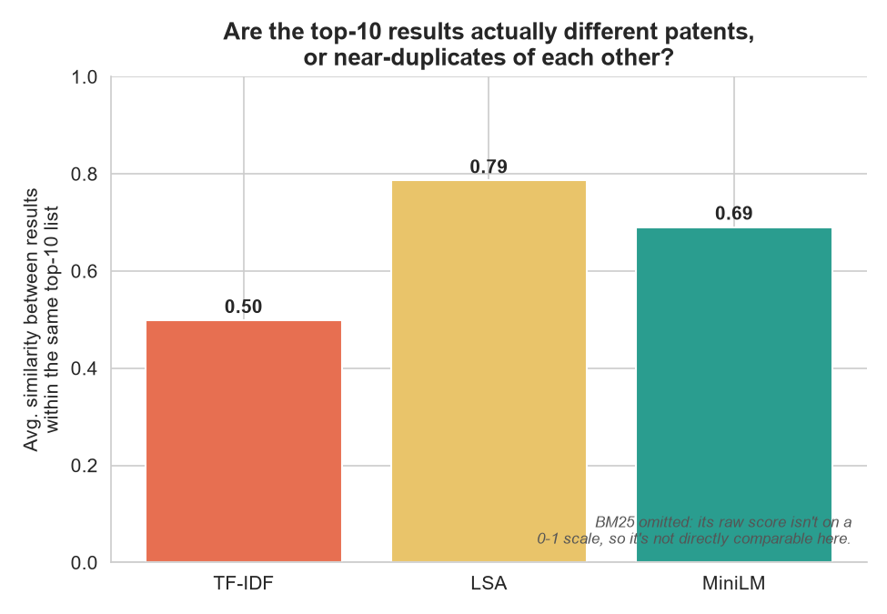
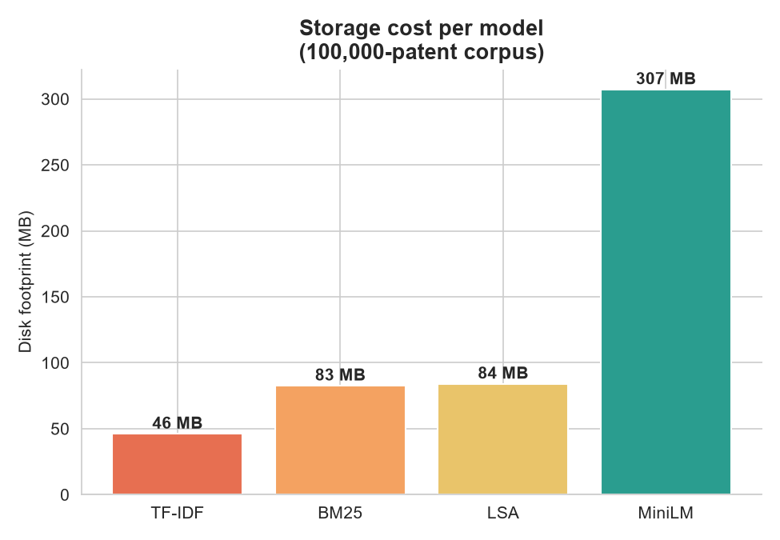

# PatentLens — Model Training Results

Produced by training on the full 100,000-patent corpus (`data/raw/patents_g06n3_wide_100k.csv`).
Re-run to regenerate every number and chart here — see Reproducing below.

## Dataset

- 100,000 US patents under CPC subclass **G06N3** (neural network architectures), title + abstract text, real citation graph. Pulled from Google Patents' public BigQuery dataset.
- Citation ground truth: 44,985 of 100,000 patents (45.0%) cite at least one other patent that also falls inside the sample — 183,973 usable citation pairs total. (Compare: an earlier 3,000-patent pilot sample had only 127 query patents / 147 pairs, 4.2% coverage — the larger corpus makes every metric below far less noisy.)
- Evaluated on 10,000 of those 44,985 query patents (randomly sampled, fixed seed) — see Limitations.
- Scaling further, or fetching directly via BigQuery yourself, is wired up in [`src/patentlens/data_fetch.py`](src/patentlens/data_fetch.py).

## Methodology

**Models compared:**

| Model | Type |
|---|---|
| TF-IDF | Lexical, unigrams+bigrams, 5000-term vocabulary |
| BM25 | Lexical, probabilistic ranking (custom sparse-matrix scorer — see Implementation note) |
| LSA | TF-IDF + Truncated SVD (100 components, 22.0% variance explained) |
| MiniLM | General-purpose sentence embeddings (`all-MiniLM-L6-v2`), GPU-encoded, FAISS-indexed |

PatentSBERTa (a patent-claims-tuned embedding model) and a BM25+PatentSBERTa hybrid were part of an earlier pilot run on the 3,000-patent sample but are not included in this 100k-patent run — PatentSBERTa's GPU encoding time (~55 min on a 4GB laptop GPU) didn't fit the available time budget for this pass. On the smaller sample it underperformed general-purpose MiniLM, so it's a lower-priority addition; re-adding it is a straightforward re-run (`retrieval.EmbeddingRetriever(model_name="AI-Growth-Lab/PatentSBERTa")`) whenever there's GPU time to spare.

**Evaluation:** for every sampled query patent, rank all other patents by similarity/score and check whether the true cited patent(s) land near the top. This is a proxy metric — patent citations are a legal/prior-art decision, not a pure text-similarity judgment — but it's the only ground truth available without manual labeling.

**Metrics:** Recall@k, Precision@k, NDCG@k (k=5,10,20), and MRR, each with a 95% bootstrap confidence interval (2,000 resamples). NDCG additionally rewards ranking a true citation *higher* within the top k, not just including it.

**Significance:** a paired bootstrap test (5,000 resamples, same queries for both models each time) checks whether the top model by MRR is *actually* better than each alternative, not just higher on a bar chart.

**Implementation note:** the `rank_bm25` library's scorer loops over every document with Python-level dict lookups per query term — fine at a few hundred evaluation queries, but ~0.35s/query at 100k documents (10,000 queries would take most of an hour). `src/patentlens/retrieval.py`'s `Bm25Retriever` reimplements standard BM25 (Robertson-Sparck Jones idf, k1/b saturation) as a precomputed sparse matrix, so ranking becomes one sparse matrix-vector multiply — the same trick that makes TF-IDF fast. Benchmarked at ~17ms/query at 100k documents, a ~20x speedup, with output verified against hand-checked examples.

## Results

| Model | Recall@10 | Precision@10 | NDCG@10 | MRR |
|---|---|---|---|---|
| **MiniLM** | 0.1034 | 0.0308 | 0.0814 | **0.1126** |
| BM25 | 0.1020 | 0.0308 | 0.0809 | 0.1106 |
| TF-IDF | 0.0790 | 0.0238 | 0.0660 | 0.0953 |
| LSA | 0.0629 | 0.0192 | 0.0553 | 0.0822 |

Full table (all k values): [`models/metrics_pivot.csv`](models/metrics_pivot.csv) (gitignored — regenerate by re-running, see below).





### Is MiniLM actually the best model, or just highest on the chart?

Paired bootstrap test, MiniLM vs. each alternative, on MRR:

| Compared to | Mean MRR gap | 95% CI | p-value | Significant at 0.05? |
|---|---|---|---|---|
| LSA | +0.0303 | [0.0271, 0.0335] | <0.001 | **Yes** |
| TF-IDF | +0.0173 | [0.0142, 0.0203] | <0.001 | **Yes** |
| BM25 | +0.0020 | [-0.0011, 0.0050] | 0.21 | No |

**Takeaway: MiniLM is confidently better than TF-IDF and LSA, but statistically indistinguishable from BM25.** Even with 10,000 evaluation queries (vs. ~150 citation pairs in the original pilot), a mean-MRR gap of 0.002 isn't distinguishable from noise. Report "MiniLM and BM25 are statistically tied for best" — not "MiniLM wins."

## Key findings

1. **Scores dropped substantially vs. the 3,000-patent pilot** (e.g., MiniLM MRR 0.113 here vs. ~0.17 there). **This is expected, not a regression.** At 100,000 patents there are far more plausible-looking distractors for any retriever to get confused by than at 3,000 — recall on a fixed-size top-k naturally falls as the haystack grows. The pilot's higher numbers were partly an artifact of a smaller, easier search space.
2. **Semantic (MiniLM) and lexical (BM25) retrieval are statistically tied on ranking quality at this scale** — but not on *why* they get there. The citation-signal test below shows MiniLM specifically wins on citation pairs with little shared vocabulary, where BM25 performs at chance. The ranking metrics tie because most citations in this corpus do share some vocabulary (same subfield, similar jargon); the tie would likely break in MiniLM's favor on a corpus with more paraphrased/cross-terminology citations.
3. **LSA remains the weakest model** — compressing to 100 components keeps only ~22% of the original TF-IDF variance at this corpus size, losing more signal than it saves in compute.
4. **Absolute scores are low across the board** (best MRR ≈ 0.11, meaning the true citation lands around rank 9 on average when it's found at all). Patent citations reflect legal/prior-art judgment as much as topical similarity, and the search space here is large — no text-only retrieval model should be expected to get anywhere close to perfect recall.
5. **Citation ground-truth coverage improved dramatically with scale** — 45.0% of patents now have an in-sample citation (up from 4.2% in the pilot), which is why every confidence interval above is much tighter than the pilot's despite evaluating on a 10k-query sample rather than the full 44,985.

## Does the model detect true relatedness, or just shared words?

Recall/MRR/NDCG above test *ranking*: does the true citation land near the top of a
full-corpus search. That's a demanding test — it competes against 100,000 other patents.
This section asks a more basic question directly: **for a real (citing, cited) pair, is
the similarity score actually higher than for a random pair of patents — and does that
hold up even when the two patents barely share any vocabulary?**

Method: sampled 15,000 real citation pairs. For each one, compared the model's similarity
score against a random non-cited patent (same citing patent, so it's an apples-to-apples
comparison). Repeated the comparison restricted to the 25% of citation pairs with the
*least* word overlap (Jaccard similarity on cleaned text) — patents that cite each other
but don't read alike. AUC of 0.5 = the score is no better than a coin flip at telling a
real citation from a random pair; 1.0 = perfect separation.

| Model | AUC (all citation pairs) | AUC (low word-overlap pairs only) | Score lift, low-overlap pairs |
|---|---|---|---|
| **MiniLM** | 0.854 | **0.696** | +31.1% |
| LSA | 0.813 | 0.605 | +40.2% |
| TF-IDF | 0.816 | 0.553 | +49.1% |
| BM25 | 0.815 | 0.517 (≈ chance) | −2.7% |




**Plain-language takeaway:** yes — every model scores true citations meaningfully higher
than random pairs overall (AUC 0.81-0.85, well above the 0.5 coin-flip line). But that
result is mostly driven by citation pairs that *do* share vocabulary, which any keyword
matcher can find. The real test is the low-word-overlap column: **BM25 collapses to
chance (0.517) and even loses money on average (−2.7% lift)** — when a citing patent
doesn't reuse the cited patent's words, pure keyword matching has nothing to work with,
by construction. TF-IDF fares only slightly better (0.553). **MiniLM is the clear
standout (0.696)** — it still recognizes roughly 7 times out of 10 that two
differently-worded patents are related, which lexical methods structurally cannot do.
This is the strongest evidence in this project that semantic embeddings add real value
over keyword search, not just marginally different rankings of the same information.

## Product metrics: what matters beyond ranking quality

Recall/MRR/NDCG and the citation-signal test answer "does it work." These answer "is it
usable" — the questions that actually decide whether a model belongs in a real tool.

**Latency** (mean time for one free-text search, 100 sampled queries):

| Model | Mean | p95 |
|---|---|---|
| BM25 | 26ms | 34ms |
| MiniLM | 29ms | 34ms |
| LSA | 118ms | 199ms |
| TF-IDF | 119ms | 149ms |



BM25 and MiniLM are both fast enough for interactive use. TF-IDF and LSA are ~4x slower —
not because the underlying math is slower, but because `retrieval.py`'s TF-IDF/LSA
`rank()` still does a full `argsort` over all 100,000 scores per query rather than a
partial top-k selection (the same optimization gap noted in Limitations previously).
Real-world impact today: still well under 200ms, fine for this use case, but worth fixing
before scaling further.

**Where should the "potential overlap" threshold actually be set?** Extends your
collaborator's TF-IDF-only threshold audit to all four models — for each, sweeps
similarity thresholds and finds the best precision/recall tradeoff (best F1):

| Model | Best threshold | Precision | Recall | F1 |
|---|---|---|---|---|
| **MiniLM** | 0.338 | 0.762 | 0.800 | **0.781** |
| LSA | 0.113 | 0.711 | 0.793 | 0.750 |
| TF-IDF | 0.021 | 0.708 | 0.790 | 0.746 |
| BM25 | 6.976 | 0.726 | 0.762 | 0.743 |



MiniLM's curve sits above every other model's across the whole range, not just at one
point — confirms it's the better choice for this specific product decision (flagging
potential overlap), not an artifact of one threshold pick. Note the current app threshold
of 0.30 (flagged as miscalibrated for TF-IDF elsewhere in this doc) happens to land close
to MiniLM's own optimum (0.338) — that coincidence doesn't hold for the other models,
which is exactly why the threshold should be set per-model, not copied across.

**Are the top-10 results actually 10 different patents?** Average similarity between
results within the same top-10 list — high means the model is returning near-duplicates
of each other rather than a genuinely varied set of related patents:



**LSA's results are the most redundant (0.79 avg internal similarity)** — consistent with
it being the weakest model elsewhere in this doc: compressing to 100 dimensions collapses
many distinct patents into the same neighborhood of latent space, so its top-10 tends to
be one cluster rather than 10 distinct ideas. TF-IDF is the most varied (0.50) — exact
keyword matching, when it hits at all, tends to hit genuinely different documents that
happen to share specific rare terms. MiniLM is in between (0.69). (BM25 omitted — its raw
score isn't on a 0-1 scale, so it isn't numerically comparable here.)

**Storage cost** (100,000-patent corpus):



MiniLM needs ~6.7x the disk of TF-IDF (307MB vs. 46MB) for its embeddings + FAISS index.
Worth knowing before scaling to millions of patents, though 307MB is trivial at 100k.

## Limitations

- **Evaluated on a 10,000-query sample, not the full 44,985 ground-truth queries** — a pragmatic tradeoff for training-run turnaround time, not a data limitation. 10,000 is already ~65x the pilot's entire ground truth (147 pairs), so this is a substantial statistical-power upgrade, not a step down.
- **Citation-based evaluation is a proxy.** A model that's "wrong" about a citation may still be topically on point — citations are filed for legal reasons (prior art disclosure requirements), not because two patents read as similar.
- **PatentSBERTa and the Hybrid model are not included in this run** (see Methodology) — on the smaller pilot sample PatentSBERTa underperformed MiniLM, so its omission here is a time-budget tradeoff, not expected to change the headline conclusion, but it hasn't been verified at this corpus size.
- **TF-IDF and LSA evaluation is still slower than ideal** (~15-17 min each for 10k queries, vs. BM25's ~4 min after the sparse-matrix rewrite) — their `rank()` implementations still do a full `argsort` per query rather than the partial-sort/argpartition optimization applied to BM25. Not a correctness issue, just a known remaining efficiency gap for future work.

## Reproducing

```bash
# from the PatentLens repo root, with venv activated
python scripts/train.py                    # checkpointed: safe to re-run, skips any already-completed step
python scripts/citation_signal_test.py     # citation-vs-random-pair test, requires train.py's output
python scripts/product_metrics.py          # latency, threshold sweep, diversity, footprint
python scripts/product_metrics_charts.py   # charts for the above
streamlit run app.py
```

`scripts/train.py` saves each fitted model and each model's evaluation results to `models/` as soon as they're computed (not just at the end), so an interrupted run can be resumed by simply running it again — already-completed steps are loaded from disk instead of recomputed. Delete files under `models/` to force specific steps to redo.
